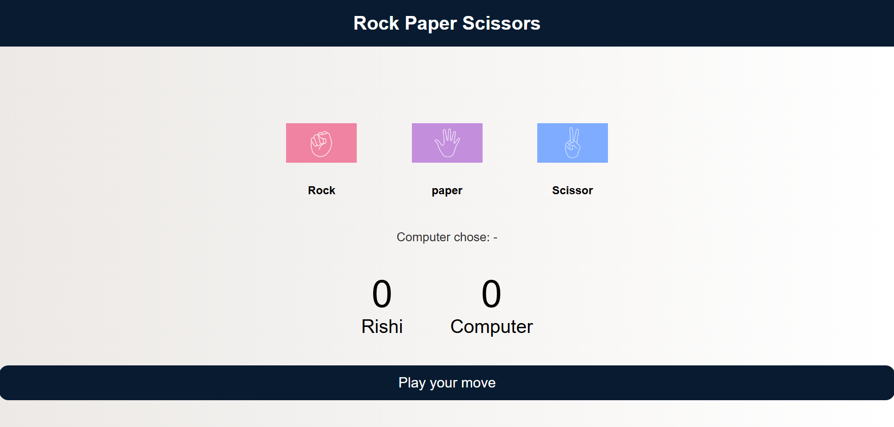
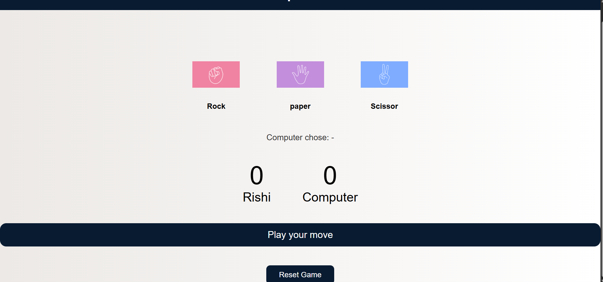

# 🎮 Rock Paper Scissors Game

A modern and interactive **Rock Paper Scissors game** built using **HTML, CSS, and JavaScript** with a clean UI, animations, and score tracking.

---

## 🚀 Live Demo

👉 https://rishisingh108.github.io/rock-paper-scissors-game/

---

## ✨ Features

* 🎯 Interactive gameplay (Rock, Paper, Scissors)
* 🎨 Clean and modern UI design
* ✨ Smooth hover and click animations
* 📊 Live score tracking (User vs Computer)
* 🔁 Reset Game functionality
* 🤖 Random computer moves
* ⚡ Fast and responsive

---

## 📸 Screenshots



-
---

## 🛠️ Tech Stack

* HTML5
* CSS3
* JavaScript (Vanilla JS)

---

## 📂 Project Structure

```id="h1u3ks"
rock-paper-scissors-game/
│── index.html
│── style.css
│── script.js
│── rock.png
│── paper.png
│── scissors.png
│── screenshot1.png
│── screenshot2.png
```

---

## 🧠 How It Works

* Player selects Rock, Paper, or Scissors
* Computer randomly generates a choice
* Game logic decides the winner
* Scores are updated in real-time
* Reset button allows restarting the game

---

## 💼 Resume Description

Developed an interactive Rock-Paper-Scissors game using HTML, CSS, and JavaScript featuring responsive UI, animations, and real-time score tracking. Deployed using GitHub Pages.

---

## 📌 Future Improvements

* 🔊 Sound effects
* 🏆 Best score tracking
* 🌙 Dark mode
* 🤖 Smart AI opponent
* 🌐 Multiplayer mode
